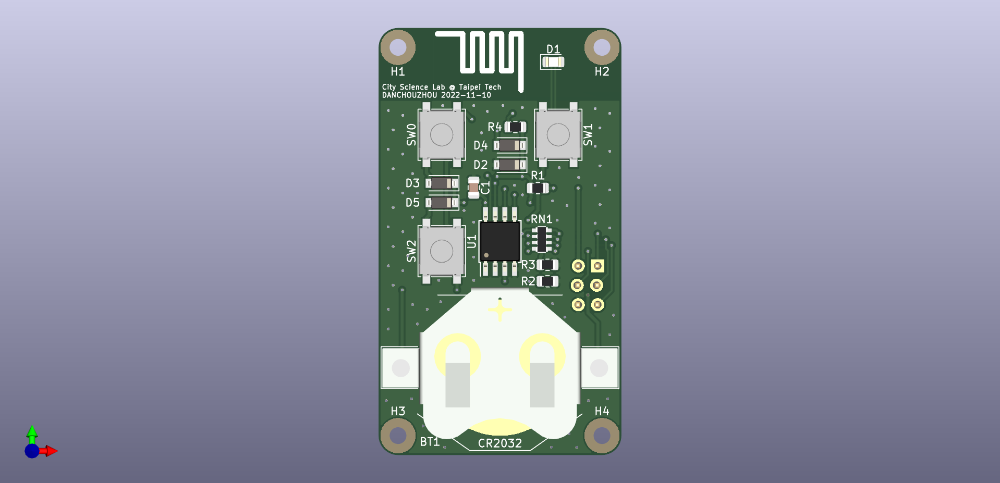

# 85RF
A 2.4G remote control made with ATtiny85

## Fetures
- ATtiny85 compatible with Arduino IDE
- nRF24L01+ / Si24R1 2.4G transceiver
- Zero quiescent current design
- Single CR2032 battery power
- Onboard 6-pin AVR-ISP header for developing and re-programming

## Arduino IDE setup
### Board manager
Check out the [installation guide of ATTinyCore](https://github.com/SpenceKonde/ATTinyCore/blob/v2.0.0-devThis-is-the-head-submit-PRs-against-this/Installation.md) by Spence Konde (aka Dr. Azzy)

### Library
This project uses [RF24](https://github.com/nRF24/RF24), the most famous library of nRF24L01. It is possible to install the library directly from library manager.

## Datasheet
- [Atmel ATtiny25, ATtiny45, ATtiny85 Datasheet](https://ww1.microchip.com/downloads/en/DeviceDoc/Atmel-2586-AVR-8-bit-Microcontroller-ATtiny25-ATtiny45-ATtiny85_Datasheet.pdf)
- [nRF24L01P_PS_v1.0.pdf - Nordic Semiconductor](https://infocenter.nordicsemi.com/pdf/nRF24L01P_PS_v1.0.pdf)
- [Ai-thinker NF-03 Specification](https://docs.ai-thinker.com/_media/nf-03_specification_en.pdf)
